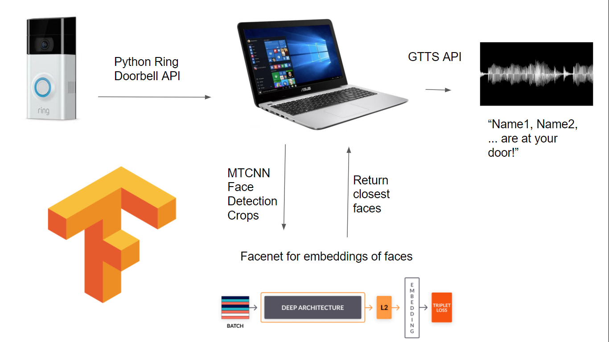
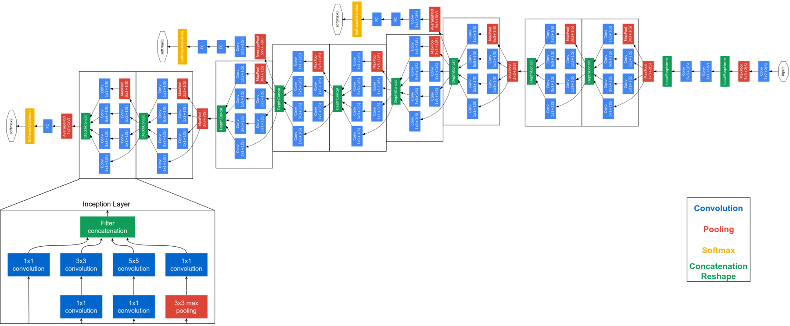

# RingFaceID: Smart Doorbell Facial Recognition System

> An intelligent facial recognition system that integrates with Amazon Ring doorbells to automatically identify visitors and announce their names via text-to-speech.

[](https://www.python.org/downloads/)
[](https://tensorflow.org/)
[](LICENSE)

---

## 🔍 Overview

RingFaceID adds intelligent face recognition capabilities to your Amazon Ring doorbell. When someone rings your doorbell, the system automatically:

1. **Captures** the doorbell video footage
2. **Detects** faces using MTCNN (Multi-task CNN)
3. **Recognizes** visitors using FaceNet deep learning model
4. **Announces** the visitor's name via text-to-speech

Perfect for families who want to know who's at the door before answering, especially useful for identifying family members, frequent visitors, or delivery personnel.



---

## 🚀 Features

- **Real-time Face Recognition**: Powered by FaceNet neural network for high accuracy
- **Ring Integration**: Seamless connection with Amazon Ring doorbells via official API
- **Dual Training Modes**: Collect face data from webcam or directly from Ring footage
- **Voice Announcements**: Text-to-speech notifications of recognized visitors
- **Unknown Visitor Detection**: Alerts when unrecognized faces are detected
- **Automatic Processing**: Runs continuously in the background, monitoring for doorbell events

---

## 🛠️ Technology Stack

- **Deep Learning**: FaceNet (TensorFlow/Keras) for face encoding and recognition
- **Face Detection**: MTCNN for robust face detection in various conditions
- **Ring API**: Official Ring doorbell Python library for video access
- **Computer Vision**: OpenCV for video processing and image manipulation
- **Audio**: gTTS (Google Text-to-Speech) for voice announcements

### Model Architecture
The system uses FaceNet, a state-of-the-art face recognition model that maps face images to a compact Euclidean space where distances correspond to face similarity.



---

## 📋 Prerequisites

### Hardware Requirements
- Amazon Ring doorbell (any model with video capability)
- Computer/Raspberry Pi running 24/7 for monitoring
- Webcam (optional, for manual face data collection)
- Speakers for audio announcements

### Software Requirements
- Python 3.8 or higher
- Amazon Ring account with 2FA enabled
- Sufficient storage for face encodings and temporary video files

---

## 🔧 Installation

### 1. Clone the Repository
```bash
git clone https://github.com/SamuelLaki/RingFaceID.git
cd RingFaceID
```

### 2. Set Up Python Environment
```bash
# Create virtual environment (recommended)
python -m venv venv
source venv/bin/activate  # On Windows: venv\Scripts\activate

# Install dependencies
pip install -r requirements.txt
```

### 3. Configure Ring Account
Set up environment variables for your Ring account:

```bash
export USERNAME="your_ring_email@example.com"
export PASSWORD="your_ring_password"
```

Or create a `.env` file:
```
USERNAME=your_ring_email@example.com
PASSWORD=your_ring_password
```

### 4. Create Required Directories
```bash
mkdir -p data/faces data/encodings
```

---

## 📖 Usage Guide

### Step 1: Collect Face Data

You have two options for collecting face images:

#### Option A: Using Webcam
```bash
python submit_face.py "John Doe" False
```
- A webcam window will open
- Press **SPACEBAR** to capture images from different angles
- Press **ESC** when finished
- Capture 5-10 images for best accuracy

#### Option B: From Ring Doorbell (Recommended)
```bash
python submit_face.py "John Doe" True
```
- Have the person ring your doorbell
- The system automatically extracts face images from the doorbell footage
- Higher accuracy due to real-world conditions

### Step 2: Create Face Encodings
After collecting all face data:
```bash
python create_encodings.py
```
This processes all collected images and creates the face recognition database.

### Step 3: Run the Recognition System
```bash
python main.py
```
The system will:
- Connect to your Ring doorbell
- Monitor for doorbell events
- Process each ring and announce the visitor
- Run continuously until stopped (Ctrl+C)

### Step 4: Test the System (Optional)
```bash
python test.py
```
Opens a webcam window to test face recognition in real-time.

---

## 🔧 Configuration

### Recognition Threshold
Adjust recognition sensitivity in `face_recognition.py`:
```python
recog_t = 0.4  # Lower = more strict, Higher = more lenient
```

### Frame Extraction Times
Modify which video frames to analyze in `submit_face.py`:
```python
times = [3, 6, 9, 12, 15, 18]  # Seconds from video start
```

---

## 📁 Project Structure

```
RingFaceID/
├── main.py                 # Entry point
├── ring.py                # Ring doorbell integration
├── face_recognition.py    # Face recognition logic
├── submit_face.py         # Face data collection
├── create_encodings.py    # Face encoding generation
├── utils.py               # Utility functions
├── test.py                # Testing interface
├── requirements.txt       # Python dependencies
├── model/
│   ├── facenet_keras.h5   # Pre-trained FaceNet model
│   └── facenet_loader.py  # Model loading utilities
├── data/
│   ├── faces/             # Collected face images
│   └── encodings/         # Generated face encodings
└── MEDIA/                 # Documentation images
```

---

## 🔐 Security & Privacy

- **Local Processing**: All face recognition happens locally on your device
- **Encrypted Storage**: Face encodings are stored securely in pickle format
- **Ring API**: Uses official Ring API with OAuth2 authentication
- **No Cloud Dependency**: No face data is sent to external services

---

## 🐛 Troubleshooting

### Common Issues

**Authentication Errors**
- Ensure Ring 2FA is enabled and working
- Check USERNAME/PASSWORD environment variables
- Delete `test_token.cache` and re-authenticate

**No Face Detected**
- Ensure good lighting when collecting face data
- Try multiple angles and expressions
- Check if face is clearly visible and not obscured

**Poor Recognition Accuracy**
- Collect more training images (10-15 recommended)
- Use Ring doorbell footage for training (more realistic conditions)
- Adjust recognition threshold in `face_recognition.py`

**Audio Issues**
- Check system audio settings and speaker connection
- Verify gTTS and playsound installation
- Test with `python -c "from gtts import gTTS; print('Audio OK')"`

---

## 🤝 Contributing

1. Fork the repository
2. Create a feature branch (`git checkout -b feature/amazing-feature`)
3. Commit your changes (`git commit -m 'Add amazing feature'`)
4. Push to the branch (`git push origin feature/amazing-feature`)
5. Open a Pull Request

---

## 📚 References

- [FaceNet Paper](https://arxiv.org/abs/1503.03832) - Original FaceNet research
- [Ring Doorbell API](https://github.com/tchellomello/python-ring-doorbell) - Python Ring integration
- [MTCNN](https://github.com/ipazc/mtcnn) - Face detection library
- [Google Text-to-Speech](https://gtts.readthedocs.io/) - TTS documentation

---

## 📄 License

This project is licensed under the MIT License - see the [LICENSE](LICENSE) file for details.

---

## 👤 Author

**Samuel Laki**
- GitHub: [@SamuelLaki](https://github.com/SamuelLaki)

---

## ⭐ Acknowledgments

- OpenAI for inspiration in AI applications
- The TensorFlow team for the excellent deep learning framework
- The Ring community for API documentation and support 
